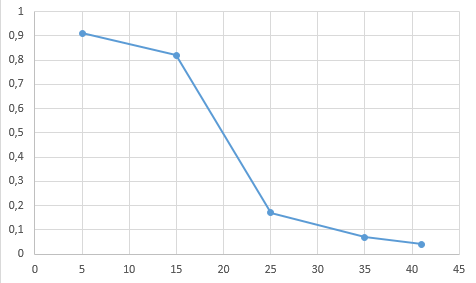

# Імітаційне моделювання комп'ютерних систем
## Лабораторная работа №1. Описание имитационных моделей
## СПм-21-2, Іванов Іван Іван Іванович
### [Traffic Basic](http://www.netlogoweb.org/launch#http://www.netlogoweb.org/assets/modelslib/Sample%20Models/Social%20Science/Traffic%20Basic.nlogo)
 

### Описание модели:
Симуляция движение автомобилей по шоссе. Каждый автомобиль следует простому набору правил: он замедляется (тормозится), если видит приближающийся автомобиль, и ускоряется (ускоряется), если впереди не видит автомобиля. Модель демонстрирует, как могут образовываться пробки.

### Управляющие параметры:
- number-of-cars. Число машин на замкнутом шоссе.
- deceleration. Изменение скорости агента на каждом игровом такте в случае наличия препятствия перед ним.
- acceleration. Приращение скорости агента на каждом игровом такте при отсутствии препятствий перед агентом.

### Внутренние параметры:
- speed. Скорость агента (перемещение машины по трассе).
- speed-limit. Верхняя граница скорости.
- speed-min. МИнимальное значение скорости агентов.

### Критерии эффективности системы:
- fastest speed of any car;
- the slowest speed of any car;
- the speed of a single car (turtle 0), painted red so it can be watched.

### Примечания:
The speed-limit and speed-min variables are set to constant values.

### Недостатки модели:
Отслеживание агентом простанства строго перед собой, хотя логично учитывать наличие препятствий на большей дистанции и сбрасывать скорость постепенно, используя указанное значение deceleration.

### Вычислительные эксперименты

#### Гипотеза 1. Влияние заггруженности дороги на среднюю скорость перемещения по ней.
Изучаем зависимость срдней скорости красной машины, на протяжении заданного числа тактов, от числа машин трассе, указанного в начале симуляции. От 5 машин, 5 симуляций, с шагом 10.

<table>
<thead>
<tr><th>number-of-cars</th><th>number-of-cars</th></tr>
</thead>
<tbody>
<tr><td>5</td><td>0,91</td></tr>
<tr><td>15</td><td>0,82</td></tr>
<tr><td>25</td><td>0,17</td></tr>
<tr><td>35</td><td>0,07</td></tr>
<tr><td>41</td><td>0,04</td></tr>
</tbody>
</table>

